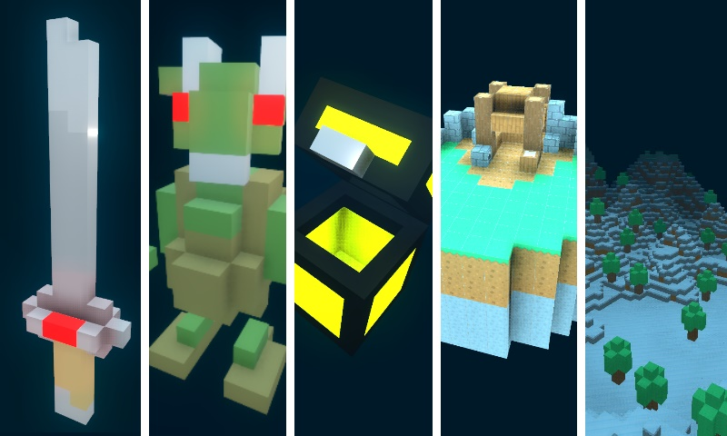

# 

Godot4 is not as smooth as godot3.

I simply upgraded the core/class part to godot 4.

Perhaps it is possible to use version 3.5 as a designer :

<h1 align="center">
	<a href="https://github.com/ClarkThyLord/Voxel-Core">
		
		 
		Voxel-Core
	</a>
</h1>

	
	
	
	

> Voxel plugin for the Godot game engine!

---

	

